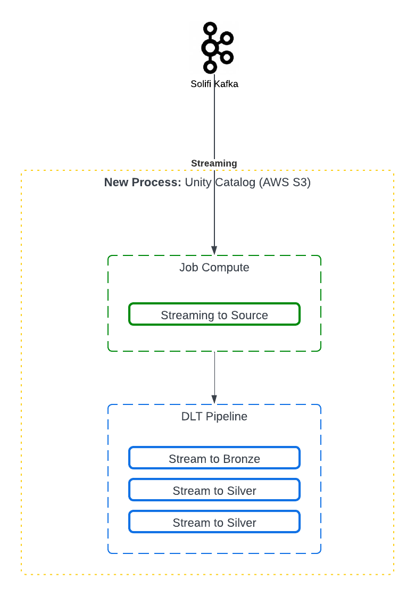

### **Process Documentation Template**

#### 1\. **Solifi Streaming Process**

*   This documentation outlines process for Solifi streaming into Databricks Source to Bronze and whereever converted to Gold Layers. 
    

#### 2\. **Objective**

*   The goal of this documentation is to create a repository of steps that are required for running the streaming process with minimal manual intervention. This document will also outline the steps to be taken incase of failures in the process. 
    

#### 3\. **Scope**

*   The source layer is a replica of the output from the Kafka Streaming. 
*   The bronze layer has the value attribute normalized into multiple columns based on the data dictionary provided by Solifi. 
*   The Silver layer is a middle tier for multiple data manipulation and normalizing individual blob columns in the dataset. 
*   The Gold layer is created for utilization in reporting and other upstream needs.
    

#### 4\. **Process Owner**

*   Bardess A Cleartelligence Company
    

#### 5\. **Stakeholders**

*   Tokyo Century IS team - Moto Tohda: mtohda@tokyocentury.com, Lance Bungay: lbungay@tokyocentury.com, Kazuyo Kaneko: Kaneko@tokyocentury.com
    

#### 6\. **Definitions & Acronyms**

*   DLT - Delta Live Tables

*   LOV - List of Values
    

#### 7\. **Process Overview**

*   **Summary:** This process demonstrates Solifi data streaming into Databricks Source and making its way through Bronze, Silver and Gold Layers.
    
*   **Flowchart:** 

#### 8\. **Streaming Process Jobs**

##### 8\.1\. **Continuous Streaming Jobs**

1.  **Step 1: Start Streaming Jobs**

    *   **Name:** 1.0 StartStreamingContinuousJob
    
    *   **Description:** The following jobs kick off the process of streaming process StartStreamingContinuousJob by unpausing a continuous streaming jobs and dlt pipelines for source to bronze loads. This happens every morning at 7 am.

    *   **Input:** 

        +   Notebook for streaming jobs: [Pause - Unpause Continuous Job](https://dbc-cb7ebf60-fb25.cloud.databricks.com/?o=6184472344017424#notebook/4333199980540665)

        +   Notebook for pipelines: [Start - Stop DLT Pipeline](https://dbc-cb7ebf60-fb25.cloud.databricks.com/?o=6184472344017424#notebook/4333199980540615)
        
    *   **Parameters:** Job Id(36123928905903) for streaming job, Pipeline Id(a4ae8416-c5ec-4f8e-9a27-b741d41dd60b) for Source to Bronze Temp and Pipeline Id(c6e194a5-31c8-44a2-a057-78bd64fa623e) for Bronze Streaming
        
    *   **Output:** Continuos jobs and dlt pipelines should start by the trigger.

    *   **Notes:** 
        
2.  **Step 2: Kafka to Source Streaming**
    
    *   **Name:**  2.0 ROS Streaming Job Continuous
        
    *   **Description:** This job continuously Streams data from kafka to Source table into Databricks. The process decrypts avro data and instantaneously puts the data in databricks. There is one notebook that can be parameterized for every topic. Non history and non-LOV topics is a task in this job. The process also stores the offset in folders in the shared folder. More infomation of checkpoints is be available in section [13. Risk & Mitigation](#13-risk-mitigation)
        
    *   **Input:** Notebook: [ros_kafka_file_load_raw_parameterized_tables_streaming](https://dbc-cb7ebf60-fb25.cloud.databricks.com/?o=6184472344017424#notebook/760556983921159)
        
    *   **Parameters:** 

        +   Environment: "Production"

        +   Topics: app_comments_v2,app_related_party,application_v2,asset,contract_setup_v2,dealer,entity_v2,related_party,user_dealer,user_info_v2,user_manager,wuser_v2,app_approval_history_v2,change_history_v2,decision_code_history_v2,decision_codes,entity_change_history_v2,security_template_v2,ua_change_history_v2,user_logon_history_v2,workflow_history_v2,workflow_step

    *   **Output:** Data loaded into source tables
        
    *   **Notes:** Incase of failures please review the [13. Risk & Mitigation](#13-risk-mitigation)

3.  **Step 3: Source to Bronze Temp DLT Pipeline Streaming**
    
    *   **Name:**  dlt_src_to_brnz_cont
        
    *   **Description:** This is a delta live pipeline that has 12 topics. There is one notebook per topic. This pipeline loads data through various steps like normalization of Json data in source to change data capture mechanism. The final datastep is loaded into temporary bronze tables. 
        
    *   **Input:** Notebook: There is one notebook per topic [ros_source_to_bronze_streaming_(topic_name)_dlt](https://dbc-cb7ebf60-fb25.cloud.databricks.com/browse/folders/760556983921207?o=6184472344017424)
        
    *   **Parameters:** 

        +   Environment: "Production"

    *   **Output:** Data loaded into bronze tables in the temporary dlt schema
        
    *   **Notes:** There are 3 tables created per topic in this step. 

4.  **Step 4: Bronze Temp to Bronze**
    
    *   **Name:**  dlt_bronze_pipeline_continuous
        
    *   **Description:** This is a delta live pipeline that has the same 12 topics like above. This is a separate pipeline due to the restriction of delta live pipelines to be able to write to 1 schema at a time. 
        
    *   **Input:** Notebook: There is one notebook per topic [ros_bronze_streaming_(topic_name)_dlt](https://dbc-cb7ebf60-fb25.cloud.databricks.com/browse/folders/760556983921209?o=6184472344017424)
        
    *   **Parameters:** 

        +   Environment: "Production"

    *   **Output:** Data loaded into bronze tables in the dlt schema
        
    *   **Notes:** 

5.  **Step 5: Stop Streaming Jobs**
    
    *   **Name:** 1.1 StopStreamingContinuousJob
    
    *   **Description:** The following jobs kick off the process of streaming process StartStreamingContinuousJob by pausing a continuous streaming jobs and dlt pipelines for source to bronze loads. This happens every morning at 8 pm.

    *   **Input:** 

        +   Notebook for streaming jobs: [Pause - Unpause Continuous Job](https://dbc-cb7ebf60-fb25.cloud.databricks.com/?o=6184472344017424#notebook/4333199980540665)

        +   Notebook for pipelines: [Start - Stop DLT Pipeline](https://dbc-cb7ebf60-fb25.cloud.databricks.com/?o=6184472344017424#notebook/4333199980540615)
        
    *   **Parameters:** Job Id(36123928905903) for streaming job, Pipeline Id(a4ae8416-c5ec-4f8e-9a27-b741d41dd60b) for Source to Bronze Temp and Pipeline Id(c6e194a5-31c8-44a2-a057-78bd64fa623e) for Bronze Streaming
        
    *   **Output:** Continuos jobs and dlt pipelines should stop by the trigger.

    *   **Notes:**  

##### 8\.2\. **Triggered Streaming Jobs**

1.  **Step 1: Existing Steps**

    *   Please refer to steps 1, 2 and 5 from [8.1 Continuous Streaming Jobs](#81-continuous-streaming-jobs) for starting the Kafka to Source Streaming

2.  **Step 2: Source to Bronze Temp DLT Pipeline Streaming**
    
    *   **Name:**  dlt_src_to_brnz_triggered
        
    *   **Description:** This is a delta live pipeline that has 10 topics. There is one notebook per topic. This pipeline loads data through various steps like normalization of Json data in source to change data capture mechanism. The final datastep is loaded into temporary bronze tables. This pipeline is triggered.

    *   **Input:** Notebook: There is one notebook per topic [ros_source_to_bronze_streaming_(topic_name)_dlt](https://dbc-cb7ebf60-fb25.cloud.databricks.com/browse/folders/760556983921208?o=6184472344017424)
        
    *   **Parameters:** 

        +   Environment: "Production"

    *   **Output:** Data loaded into bronze tables in the temporary dlt schema
        
    *   **Notes:** There are 3 tables created per topic in this step. 

3.  **Step 3: Bronze Temp to Bronze**
    
    *   **Name:**  dlt_bronze_pipeline_continuous
        
    *   **Description:** This is a delta live pipeline that has the same 10 topics like above. This is a separate pipeline due to the restriction of delta live pipelines to be able to write to 1 schema at a time. 
        
    *   **Input:** Notebook: There is one notebook per topic [ros_bronze_streaming_(topic_name)_dlt](https://dbc-cb7ebf60-fb25.cloud.databricks.com/browse/folders/760556983921210?o=6184472344017424)
        
    *   **Parameters:** 

        +   Environment: "Production"

    *   **Output:** Data loaded into bronze tables in the dlt schema
        
    *   **Notes:** 

_(Continue as needed for each step in the process)_

#### 9\. **Roles & Responsibilities**
-   Development Team:
    
    *   Architecture and Development: Lisa Iyer(liyer@bardess.com)
    
    *   Dev Manager: John Fico(jfico@bardess.com)

    *   Requirements: Tokyo Century IS team - Moto Tohda: mtohda@tokyocentury.com, Lance Bungay: lbungay@tokyocentury.com
    

#### 10\. **Metrics & KPIs**

-   Input required from Tokyo Century IS team for metrics and kpi.

#### 11\. **Risk & Mitigation**

-   **Potential Risks:** 

    *   Data Streaming

        +   Data Quality Issues: Corrupted, incomplete, or changing data formats can disrupt processing.

        +   Data Loss: Network failures or storage limitations can lead to dropped data.

-   **Mitigation Plans:**

    *   Data Streaming

        +   Check Point Creation: Checkpoint creation helps mitigate data loss in streaming systems by regularly saving the state and progress of data processing. This allows the system to restart from the last saved point in case of a failure or interruption, ensuring that processed data is not lost and unprocessed data can resume from where it left off, minimizing the risk of data duplication or gaps.

        +   Offset: The check point process saves the latest offset as it processes data in the designated folders. The offsets can be manipulated for data loss or any data quality issues. This helps reprocess the streaming data from the last offset stored in the checkpoint folder. The offsets can also be used for reprocessing all the data in the Kafka pipeline if a need arises. More on offsets in the next section
    
    *   Offset: Step by step instructions for offset manipulation

        +   **Prestep:** Please make sure no jobs are running while you manipulate the offsets.

        +   **Step 1:** Offsets are stored in the [offset folder](https://dbc-cb7ebf60-fb25.cloud.databricks.com/browse/folders/26020979356809?o=6184472344017424)

        +   **Step 2:** Incase of data loss or data quality issues this [reset offset](https://dbc-cb7ebf60-fb25.cloud.databricks.com/?o=6184472344017424#notebook/560215169027151) notebook is created that can be run manually step by step. **Please do not run all the notebook at once**

        +   **Step 3:** Run Step 1 through Step 5 in the notebook. These steps define various functions that will be then run during the resetting process.

        +   **Step 4:** In Step 6 of the notebook you need to add environment and topics. You can add one or more topics. *It is recommended to not add more than 5 topics.*

        +   **Step 5:** Step 7.1 and Step 7.2 on the notebook can be run after step 6 is set. 

            *Please Note: No jobs should be running while you manipulate the offsets.* 

            *Please Note: The table is set to only show top 2 entries for each topic.* 

        +   **Step 6:** In Step 7.3 please provide inputs from filename after carefully reviewing which offset needs to be deleted. Add the offset in the minimum offset. The process takes care of deleting the rest of the offsets after that point. 

        +   **Step 7:** Step 8 is optional and not recommended.

#### 12\. **Related Documents**

-   [Migration from Batch Processing to Streaming in Databricks](http://127.0.0.1:8000/documentation/customer-repositories/tokyo-century/ros/migration-docs/migration_steps_batch_streaming_solifi/)
    

#### 13\. **Review & Maintenance**

-   **Frequency:** As needed
    
-   **Next Review Date:** \[Date for the next review\]
    

#### 14\. **Approval**

-   **Approved By:** John Fico
    
-   **Approval Date:** \[Date\]